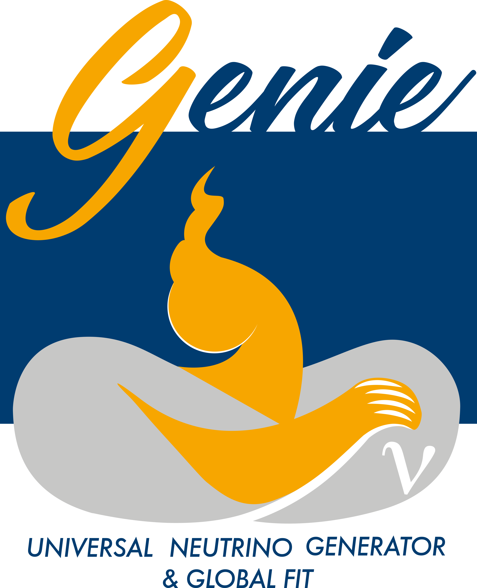

# The GENIE Event Generator

<table style="border-collapse: collapse; border: none;">
  <tr>
    <td style="border: none; padding-right: 12px; vertical-align: top;">
      
    </td>
    <td style="border: none; padding: 0;">
      

        The GENIE Generator is a <b>leading simulation tool used by nearly all modern neutrino experiments</b>. 
        It features a <b>modular framework</b> with <b>state-of-the-art physics</b> for neutrino and charged-lepton interactions, 
        and several BSM channels. It incorporates results from GENIE’s global data analysis and includes multiple tuned models. 
        GENIE supports all neutrino types, targets, and energy scales from MeV to PeV, 
        and provides tools for flux handling, geometry, event generation, and reweighting.
      

      

        For more information, visit 
        <a href="http://www.genie-mc.org" target="_blank">http://genie-mc.org</a> |
        <a href="https://genie-mc.github.io" target="_blank">https://genie-mc.github.io</a>.
      

    </td>
  </tr>
</table>

## Authors:

Luis Alvarez-Ruso (*IFIC*), Costas Andreopoulos (*Liverpool*), Adi Ashkenazi (*Tel Aviv*), Joshua Barrow (*Minnesota*), Steve Dytman (*Pittsburgh*), Hugh Gallagher (*Tufts*), Alfonso Andres Garcia Soto (*IFIC*), Steven Gardiner (*Fermilab*), Matan Goldenberg (*Tel Aviv*), Robert Hatcher (*Fermilab*), Or Hen (*MIT*), Igor Kakorin (*JINR*), Konstantin Kuzmin (*ITEP and JINR*), Liang Liu (*Fermilab*), Xianguo Lu (*Warwick*), Anselmo Meregaglia (*Bordeaux, CNRS/IN2P3*), Vadim Naumov (*JINR*), Afroditi Papadopoulou (*Argonne*), Gabriel Perdue (*Fermilab*), Komninos-John Plows (*Oxford*), Marco Roda (*Liverpool*), Alon Sportes (*Tel Aviv*), Júlia Tena Vidal (*Tel Aviv*), Jeremy Wolcott (*Tufts*), Qiyu Yan (*UCAS and Warwick*)

**Past authors:** Christopher Barry (*Liverpool*), Steve Dennis (*Liverpool*), Walter Giele (*Fermilab*), Timothy Hobbs (*Fermilab*), Libo Jiang (*Pittsburgh*), Rhiannon Jones (*Liverpool*), Weijun Li (*Oxford*), Donna Naples (*Pittsburgh*), Beth Slater (*Liverpool*), Noah Steinberg (*Fermilab*), Vladyslav Syrotenko (*Tufts*), Julia Yarba (*Fermilab*) 

For more details on the GENIE collaboration please visit [this page](https://genie-mc.github.io/collaboration.html).

## Copyright

Copyright (c) 2003-2025, The GENIE Collaboration. For information, visit [this page](https://genie-mc.github.io/copyright.html).

## Citing GENIE

If you use GENIE, please cite it properly. [Click here for citation guidelines](https://genie-mc.github.io/citing.html).

DOIs for recent releases of the GENIE Event Generator are listed below:

- v3.06.02 
- v3.06.00 
- v3.04.02 
- v3.04.00 
- v3.02.02 
- v3.02.00 
- v3.00.06 
- v3.00.04 
- v3.00.02 
- v3.00.00 

## Physics & User manual

For installation and usage information, as well as information on the GENIE framework, event generator modules and tuning, 
see the [latest version of the GENIE Physics & User Manual](https://www.overleaf.com/read/rqmbqzzvsvmb#5ab475), originally published as arXiv:1510.05494.

## Public releases and physics tunes

For a list of public releases and a summary information, see [this page](https://genie-mc.github.io/releases.html).
A list of model configurations and tunes supported in each release is maintained [here](https://genie-mc.github.io/tunes.html).
Details on the naming conventions for releases, model configurations and tunes can be found [here](https://genie-mc.github.io/naming_conventions.html).

[Recent publications and talks](https://genie-mc.github.io/pub.html) 
by GENIE authors highlight key modeling advances and results from our global analysis of scattering data.

## Contribution guidelines

**GENIE welcomes community contributions through its Incubator**. This is the designated space where all development work exceeding a certain complexity threshold is carried out. It is structured as a collection of focused incubator projects. Incubator projects are internal or community-led development efforts, overseen by the GENIE scientific and technical leadership. They represent the exclusive pathway for integrating physics or software developments into official GENIE product releases. For details, please visit [this page](https://genie-mc.github.io/incubator.html).

## Contact

For all enquiries, please contact:  
**Prof. Costas Andreopoulos**  
University of Liverpool, Department of Physics, Oliver Lodge Lab 316,  Liverpool L69 7ZE, UK   
E-Mail: < c.andreopoulos \at cern.ch >  
Telephone: +44 151 794 3201 (Office) | +44 754 084 7333 (Mobile)
